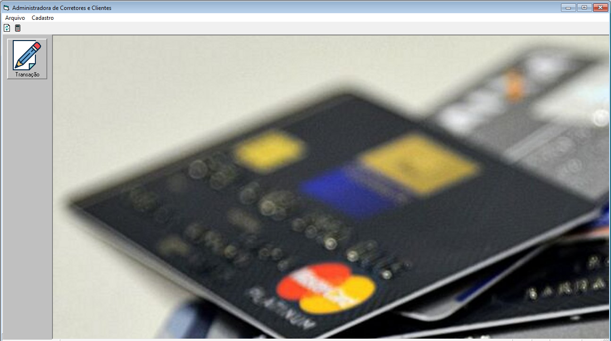
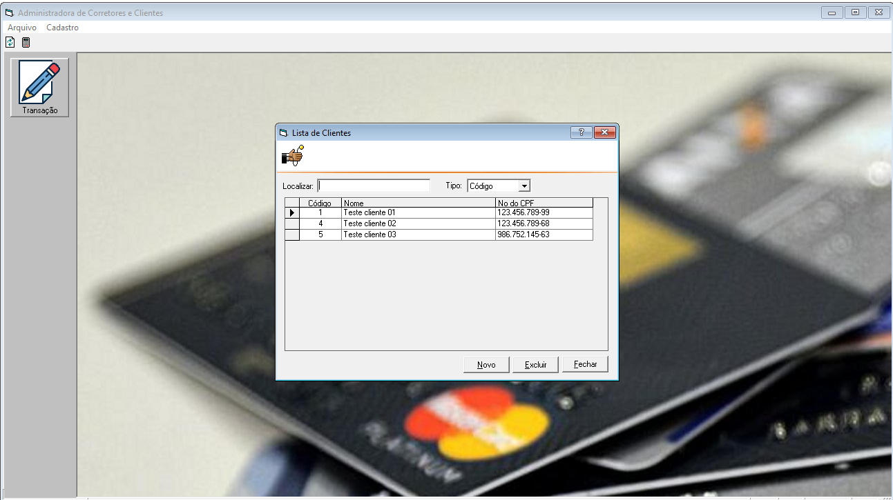
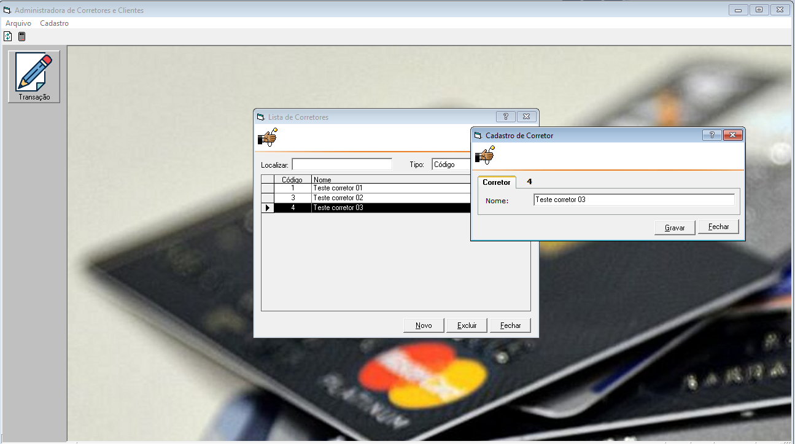
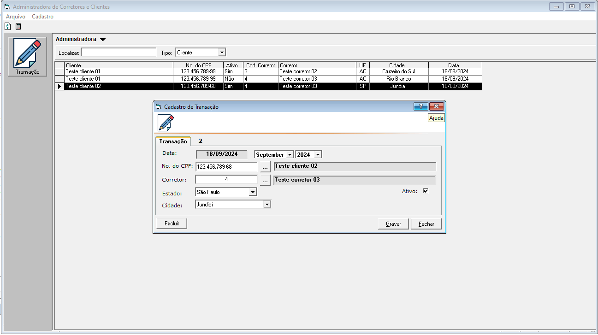
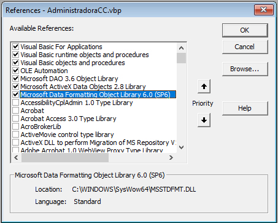
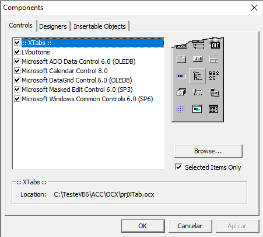

# Gerenciamento de Transações - Administradora de Corretores e Clientes

## Descrição
O projeto de cadastro de corretores e clientes foi desenvolvido em Visual Basic 6 (VB6), utilizando um banco de dados SQL Server, conforme os requisitos estabelecidos no teste técnico. O sistema foi estruturado em três principais páginas: Cadastro de Corretores, Cadastro de Clientes e Cadastro de Transação, proporcionando uma navegação intuitiva.
Para garantir a integridade dos dados, um banco de dados SQL Server foi configurado com tabelas específicas para corretores, clientes e transação. A lógica implementada impede cadastros duplicados, assegurando que um CPF não possa ser compartilhado entre corretores e clientes, e garantindo que cada cliente tenha um corretor responsável.
Ao final do desenvolvimento, o código-fonte e o aplicativo compilado foram disponibilizados em uma plataforma de nuvem, atendendo à exigência de entrega do projeto. Scripts de criação do banco de dados e usuários foram elaborados para garantir que todos os objetos necessários fossem configurados adequadamente. Além disso, um manual simples foi criado com instruções claras sobre a instalação da aplicação e as alterações necessárias nos arquivos de configuração.
O resultado final foi um sistema funcional, desenvolvido com base em boas práticas de programação e design de interface, priorizando a usabilidade e a manutenção, pronto para ser utilizado em um ambiente real.

## Funcionalidades
A aplicação desenvolvida oferece as seguintes funcionalidades:

### CRUD de Clientes
- **Inserção de Clientes**: Permite registrar novos clientes.
- **Edição de Clientes**: Modificação de clientes já existentes.
- **Exclusão de Clientes**: Remoção de clientes específicas.
- **Consulta de Clientes**: Permite filtrar clientes por `Código`, `Nome` e 'CPF' usando uma interface simples com caixas de texto e uma DataGrid para exibição.

### CRUD de Corretores
- **Inserção de Corretores**: Permite registrar novos corretores.
- **Edição de Corretores**: Modificação de corretores já existentes.
- **Exclusão de Corretores**: Remoção de corretores específicas.
- **Consulta de Corretores**: Permite filtrar corretores por `Código`, `Nome` usando uma interface simples com caixas de texto e uma DataGrid para exibição.

### CRUD de Transações
- **Inserção de Transações**: Permite registrar novas transações de cartões de crédito com os seguintes campos: `Id_Transacao`, `Numero_Cartao`, `Valor_Transacao`, `Data_Transacao`, `Descricao`.
- **Edição de Transações**: Modificação de transações já existentes.
- **Exclusão de Transações**: Remoção de transações específicas.
- **Consulta de Transações**: Permite filtrar transações por `Cliente`, `CPF`, 'Corretor', 'Ativo' e `Data` usando uma interface simples com caixas de texto e uma DataGrid para exibição.

## Tecnologias Utilizadas
- **VB6**: Utilizado para o desenvolvimento da interface e funcionalidades do CRUD.
- **SQL Server**: Utilizado para armazenar os dados e implementar as stored procedures, funções e views.

## Estrutura do Projeto
O projeto é composto pelos seguintes módulos principais:

### Interface de Usuário
- Interface desenvolvida em **VB6** com caixas de texto para inserção e consulta de dados, botões para as operações de CRUD, e uma **DataGrid** para exibição dos resultados.

### Banco de Dados
- **Tabela de Transações**: Armazena as informações de cada cliente, corretor e transação.
- **Stored Procedures e Funções**: Implementadas para realizar clientes, corretores e transações de forma eficiente.
- **View**: Combina dados de transações de clientes, corretores das transações.

## Requisitos de Avaliação
- **Qualidade do Código**: Segui boas práticas de programação tanto no VB6 quanto nas queries SQL.
- **Eficiência**: As queries SQL foram otimizadas para lidar com grandes volumes de dados.
- **Interface Simples e Funcional**: A interface da aplicação é clara e de fácil uso, permitindo o gerenciamento de transações de forma eficiente.

## Para teste do desafio
- **Crie uma pasta no raiz C:\TesteVB6
- **Descompacta os arquivos neste diretório
- **Configura as Referências e Componentes do VB6
- **Script da base de dados no diretório \BancoDeDados

 
<h1 align="center">
    
</h1>

 
<h1 align="center">
    
</h1>

 
<h1 align="center">
    
</h1>

 
<h1 align="center">
    
</h1>

 
<h1 align="center">
    
</h1>

 
<h1 align="center">
    
</h1>

## Conclusão
Este projeto entrega uma solução completa para o gerenciamento de clientes, corretores e transações entre os mesmos, com funcionalidades robustas e integração eficiente com o SQL Server.

